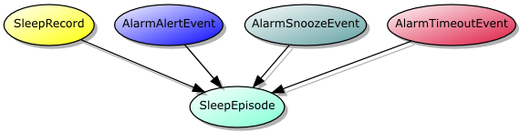

=============================
Open Zeo - Android Mobile API
=============================

:author: Zeo Inc.
:date: 2011-11-28

.. contents:: Table of Contents
.. sectnum::
.. target-notes::

Introduction
============

Welcome to the home of the Open Zeo Android Mobile API which is a specification
and helper software for interfacing your Android applications with Zeo Mobile
Sleep Manager's data store. Here you will find a contract, and sample
applications for interfacing that you can use to base your projects upon.

For the impatient please see the Quickstart_ instructions on how to interface
with the Zeo data. From there look at this documents sections on zeo sleep
data, sleep event/episode, headband sleep records, and headbands for further
details about the data offered up by the provider.

Quickstart
==========

#. Make sure Zeo Sleep Manager is installed on Android device and has accumulated sleep data.

#. Add the Android library ZeoDataContract.jar to your project.

#. Add to your AndroidManifest.xml the following permission
::

   <uses-permission android:name="com.myzeo.permission.READ_SLEEP_RECORDS"/>

#. Attempt to query the data provider for zq scores of all sleep records from within an activity
::

   import static com.myzeo.android.api.data.ZeoDataContract.SleepRecord;
   // ...
   String[] projection = new String[] {SleepRecord.ZQ_SCORE};
   final Cursor cursor = getContentResolver().query(SleepRecord.CONTENT_URI,
                                                    projection, null, null, null);
   if (cursor.moveToFirst()) {
       do {
           Log.d(TAG, "Zq score of: " + cursor.getInt(0));
       } while (cursor.moveToNext());
   } else {
       Log.w(TAG, "No sleep records found.");
   }
   cursor.close();

Basics
======

Download the this project from github via::
   git clone git://github.com/zeoeng/zeo-android-api.git

and either copy the ZeoDataContract.java to a correct package directory layout
within your own source tree OR include the android library project into your
build system. Information on including android library projects is found in
Android documentation for `Managing Projects from Eclipse`_ and `Managing
Projects from the Command Line`_.

.. _`Managing Projects from Eclipse`: http://developer.android.com/guide/developing/projects/projects-eclipse.html#ReferencingLibraryProject
.. _`Managing Projects from the Command Line`: http://developer.android.com/guide/developing/projects/projects-cmdline.html#ReferencingLibraryProject

The Zeo data content provider utilizes the content authority
"ZeoDataContract.BASE_CONTENT_AUTHORITY" and houses five static classes
containing information useful for analyzing zeo data; presented in the
following image.

All of the static classes contain a Uri member field named CONTENT_AUTHORITY
which allows access to content for that table in the provider.  An example of
this is say::

   ZeoDataContract.SleepRecord.CONTENT_AUTHORITY

The Zeo data provider works similar to other data providers in that usage of::

   ContentUris.withAppendedId(ZeoDataContract.SleepRecord.CONTENT_AUTHORITY, 2);

will access sleep record with primary key (BaseColumns._ID) number of 2 as
expected.

Description of Provider Tables
------------------------------

+-----------------+------------------------------------------------------------+
| Table           | Description                                                |
+=================+============================================================+
|SleepEpisode     |The joining table for all aspects of a particular sleep     |
|                 |episode. Data sources for a sleep episode are currently Zeo |
|                 |headband sent information but at some later date might      |
|                 |include other information.                                  |
+-----------------+------------------------------------------------------------+
|SleepRecord      |Data records sent by a Zeo headband or culled from the      |
|                 |myzeo.com website. Regardless of the source of these        |
|                 |records; this data represents information that Zeo recorded |
|                 |and processed from user's brain activity. **Please note that|
|                 |a more correct name for this would be headband sleep        |
|                 |record.**                                                   |
+-----------------+------------------------------------------------------------+
|Headband         |Represents the state of the Zeo headband be in paired /     |
|                 |unpaired, docked / undocked, on head / off head, etc...     |
+-----------------+------------------------------------------------------------+
|AlarmAlertEvent  |An instance of the Android phone's alarm ringing after an   |
|                 |alarm was preconfigured to go off at a certain point OR the |
|                 |alarm is ringing again due to a snooze.                     |
+-----------------+------------------------------------------------------------+
|AlarmSnoozeEvent |Instance of user pressing the snooze button on the alarm to |
|                 |trigger the alarm pausing temporarily for a user configured |
|                 |amount of time.                                             |
+-----------------+------------------------------------------------------------+
|AlarmTimeoutEvent|Event that marks point in time where alarm ultimately       |
|                 |stopped emitting audio as it went unattended for some       |
|                 |significant length of time. Alarm timeout is an attempt to  |
|                 |prevent annoyance of neighbors due to alarm clock going off |
|                 |with no possibility that someone will stop it.              |
+-----------------+------------------------------------------------------------+

User Permissions
================

To read data from the Zeo data provider you must include the
*READ_SLEEP_RECORDS* permission in your manifest file::

   <uses-permission android:name="com.myzeo.permission.READ_SLEEP_RECORDS"/>

Data Types
==========

The following section lists data types used within the Zeo data provider.

Unix timestamp
--------------

All Unix timestamps are represented as milliseconds since the Unix epoch which
require representation by 64 bit signed integers as natural for the Java
programming language. These values are in UTC; use the timezone information to
determine the local time for when events occurred.

Sleep Stages
------------

Zeo defines the following sleep stages for its hypnogram data
::

   STAGE_UNDEFINED = 0,
   STAGE_WAKE = 1,
   STAGE_REM = 2,
   STAGE_LIGHT = 3,
   STAGE_DEEP = 4

Sleep Epoch
-----------

A data value representing 30 seconds worth of some samples. This value is upped
to 5 minutes in the case of the display hypnogram sleep stages.

Sleep Episode (Event)
=====================

.. note::

   Internally sleep episode is currently named *sleep_event* but will
   eventually be renamed though the former name will continue to function for
   an unspecified amount of time after the transition is made; see `Semantic
   Versioning <http://semver.org/>`_.

A sleep event or sleep episode is a meta joining table that unites various
sources of sleep information into a coherent logical collection of data for a
given event/episode of sleep. The mapping of real life sleep to Zeo's notion of
a sleep episode/event is one to one.

The URI to access the sleep episode data is::

   SleepEpisode.CONTENT_URI

+--------------+--------------+-----------------------------------------------+
|Field Name    |Type          |Description                                    |
+==============+==============+===============================================+
|_ID           |primary key   |The identifier for the sleep event.            |
+--------------+--------------+-----------------------------------------------+
|START_OF_NIGHT|unix timestamp|Timestamp marks the beginning of a sleep       |
|              |              |episode.                                       |
+--------------+--------------+-----------------------------------------------+
|END_OF_NIGHT  |unix timestamp|Timestamp marks the ending of a sleep episode. |
+--------------+--------------+-----------------------------------------------+

Sleep Record
============

The headband sleep table defines records containing sleep data as sent by the
Zeo headband during operation. This data is the primary source of sleep
information obtained by the app from the headband. As the night progresses the
headband continuously updates this data structure with the app updating the
existing record with the latest details regarding sleep.  Momentary bluetooth
interruptions are tolerable as the final record sent from the headband to the
app will contain all information accumulated by the headband up to that point
in time.

The URI to access headband sleep record data is::

  SleepRecord.CONTENT_URI

+-----------------+------------+-----------------------------------------------+
|Field Name       |Type        |Description                                    |
+=================+============+===============================================+
|SLEEP_EPISODE_ID |foreign key |Foreign key pointing to the sleep episode for  |
|                 |            |which this sleep record corresponds to.        |
+-----------------+------------+-----------------------------------------------+
|AWAKENINGS       |integer     |Number of times user awoke throughout the      |
|                 |            |night.                                         |
+-----------------+------------+-----------------------------------------------+
|BASE_HYPNOGRAM   |array of    |Array containing sleep stages where each stage |
|                 |sleep stages|corresponds to 30 seconds of sleep.            |
+-----------------+------------+-----------------------------------------------+
|DISPLAY_HYPNOGRAM|array of    |Array containing sleep stages where each stage |
|                 |sleep stages|corresponds to 5 minutes of sleep.             |
+-----------------+------------+-----------------------------------------------+
|END_OF_NIGHT     |unix        |Timestamp marks the conclusion of the record.  |
|                 |timestamp   |                                               |
+-----------------+------------+-----------------------------------------------+
|END_REASON       |enumerated  |Reason that this sleep record concluded. The   |
|                 |type        |possible values are::                          |
|                 |            |                                               |
|                 |            |   0 = Complete record                         |
|                 |            |   1 = Record is still active                  |
|                 |            |   2 = Headband battery died                   |
|                 |            |   3 = Headband disconnected                   |
|                 |            |   4 = Service was killed on Android device    |
|                 |            |                                               |
+-----------------+------------+-----------------------------------------------+
|HEADBAND_ID      |foreign key |The ID number of the headband that recorded    |
|                 |            |this sleep.                                    |
+-----------------+------------+-----------------------------------------------+
|TIME_IN_DEEP     |epochs      |Number of 30 second sleep epochs that user was |
|                 |            |in deep sleep.                                 |
+-----------------+------------+-----------------------------------------------+
|TIME_IN_LIGHT    |epochs      |Number of 30 second sleep epochs that user was |
|                 |            |in light sleep.                                |
+-----------------+------------+-----------------------------------------------+
|TIME_IN_REM      |epochs      |Number of 30 second sleep epochs that user was |
|                 |            |in REM sleep.                                  |
+-----------------+------------+-----------------------------------------------+
|TIME_IN_WAKE     |epochs      |Number of 30 second epochs that user was awake.|
+-----------------+------------+-----------------------------------------------+
|TIME_TO_Z        |epochs      |Number of 30 second sleep epochs before sleep  |
|                 |            |onset.                                         |
+-----------------+------------+-----------------------------------------------+
|TOTAL_Z          |epochs      |Number of 30 second sleep epochs that user was |
|                 |            |asleep.                                        |
+-----------------+------------+-----------------------------------------------+
|ZQ_SCORE         |integer     |Metric by which Zeo determines how well the    |
|                 |            |user slept.                                    |
+-----------------+------------+-----------------------------------------------+
|TIMEZONE         |TZ string   |A timezone string in the form of::             |
|                 |            |                                               |
|                 |            |   America/New_York                            |
|                 |            |                                               |
|                 |            |that represents timezone Android device was in |
|                 |            |when record was recorded.                      |
+-----------------+------------+-----------------------------------------------+
|START_OF_NIGHT   |unix        |Timestamp marks the beginning of the record.   |
|                 |timestamp   |                                               |
+-----------------+------------+-----------------------------------------------+
|END_OF_NIGHT     |unix        |Timestamp marks the end of the record.         |
|                 |timestamp   |                                               |
+-----------------+------------+-----------------------------------------------+
|SOURCE           |enum        |The originating source for this record one of::|
|                 |            |                                               |
|                 |            |   0 = data source is primary (a headband)     |
|                 |            |   1 = data source is remote server (myzeo.com)|
|                 |            |                                               |
+-----------------+------------+-----------------------------------------------+

Headband
========

Representation of the state of the Zeo headband which is gathered form the
communication messaging system that occurs between the Android device and the
headband.

The URI to access headband sleep record data is::

   Headband.CONTENT_URI

+-------------------------+------------+-----------------------------------------------+
|Field Name               |Type        |Description                                    |
+=========================+============+===============================================+
|ALGORITHM_MODE           |enum        |The current mode of the sleep algorithm running|
|                         |            |on headband which is one of::                  |
|                         |            |                                               |
|                         |            |   -1 = undefined mode                         |
|                         |            |    0 = mode idle                              |
|                         |            |    1 = tentative active (starting up)         |
|                         |            |    2 = actively recording sleep               |
|                         |            |    3 = tentative idle (shutting down)         |
+-------------------------+------------+-----------------------------------------------+
|BLUETOOTH_ADDRESS        |6 byte      |String representation bluetooth 48 bit address |
|                         |string      |in the form of::                               |
|                         |            |                                               |
|                         |            |   11:22:33:44:55:66                           |
|                         |            |                                               |
|                         |            |which is natural for feeding to Android        |
|                         |            |BluetoothDevice.                               |
+-------------------------+------------+-----------------------------------------------+
|BLUETOOTH_FRIENDLY_NAME  |string      |Bluetooth name shown to the user.              |
+-------------------------+------------+-----------------------------------------------+
|BONDED                   |boolean     |Headband is bonded to the Android device.      |
+-------------------------+------------+-----------------------------------------------+
|CLOCK_OFFSET             |milliseconds|number of milliseconds offset between Android  |
|                         |            |device's notion of time versus the headband's. |
+-------------------------+------------+-----------------------------------------------+
|CONNECTED                |boolean     |Whether or not the headband is current         |
|                         |            |connected to the Android device.               |
+-------------------------+------------+-----------------------------------------------+
|DOCKED                   |boolean     |Flag that indicates headband is docked on the  |
|                         |            |charger.                                       |
+-------------------------+------------+-----------------------------------------------+
|ON_HEAD                  |boolean     |Flag indicates that headband is on the user's  |
|                         |            |head; false otherwise.                         |
+-------------------------+------------+-----------------------------------------------+
|SW_VERSION               |string      |The version of the firmware running on the     |
|                         |            |headband.                                      |
+-------------------------+------------+-----------------------------------------------+

AlarmAlertEvent
===============

An instance of the alarm ringing either due to alarm time, smart wake, or alarm
after snooze.

URI to access the alarm alert events is::

  AlarmAlertEvent.CONTENT_URI

+----------------+---------+---------------------------------------------------------+
|Field Name      |Type     |Description                                              |
|                |         |                                                         |
+================+=========+=========================================================+
|SLEEP_EPISODE_ID|foreign  |Foreign key pointing to the sleep episode for which this |
|                |key      |alert correspond to.                                     |
+----------------+---------+---------------------------------------------------------+
|REASON          |enum     |Reason the alarm rang populated when smart wake is       |
|                |         |enabled. This is the reason the headband thought to wake |
|                |         |user. Value is::                                         |
|                |         |                                                         |
|                |         |   0 = No reason for ring (alarm rang on time)           |
|                |         |   1 = User rising out of deep sleep                     |
|                |         |   2 = User went from non-REM to REM sleep               |
|                |         |   3 = User went from rem to non-rem sleep               |
|                |         |   4 = User was already awake so the alarm rang.         |
+----------------+---------+---------------------------------------------------------+
|SMART_WAKE      |boolean  |Flag indicates user requested that Zeo use its smart wake|
|                |         |capabilities to try to wake up user at most optimum time.|
+----------------+---------+---------------------------------------------------------+
|TIMESTAMP       |unix     |The Unix timestamp marking when the alarm went off.      |
|                |timestamp|                                                         |
+----------------+---------+---------------------------------------------------------+
|WAKE_TONE       |string   |A string that indicates what wake music was used to awake|
|                |         |the user. This can be either Zeo music or Android        |
|                |         |ringtones. Zeo Music is URI with content authority::     |
|                |         |                                                         |
|                |         |   content://com.myzeo.music                             |
|                |         |                                                         |
|                |         |Standard Android ringtone is::                           |
|                |         |                                                         |
|                |         |  media://                                               |
+----------------+---------+---------------------------------------------------------+
|WAKE_WINDOW     |integer  |The number of minutes prior to the alarm time that the   |
|                |         |user configured the alarm to possibly awake them when    |
|                |         |smart wake is enabled.                                   |
+----------------+---------+---------------------------------------------------------+

AlarmSnoozeEvent
================

Alarm snooze is a recording of the user snoozing the actively ringing
alarm. The duration (minutes) that the alarm snoozes was preconfigured by the
user for the alarm that went off (Zeo supports multiple alarms). Records of
this type store that information along with when the alarm was snoozed for
potential future analysis.

Content Uri for accessing snooze data is::

  AlarmSnoozeEvent.CONTENT_URI

+----------------+-------------------------------------------------------------------+
|Field Name      |Description                                                        |
+================+===================================================================+
|SLEEP_EPISODE_ID|Foreign key pointing to the sleep episode for which this snooze    |
|                |correspond to.                                                     |
+----------------+-------------------------------------------------------------------+
|DURATION        |Number of minutes the alarm was set to snooze after user triggered |
|                |snooze.                                                            |
+----------------+-------------------------------------------------------------------+
|TIMESTAMP       |Unix timestamp in milliseconds that represents the time when user  |
|                |pressed the snooze button.                                         |
+----------------+-------------------------------------------------------------------+

AlarmTimeoutEvent
=================

Alarm timeout is when the alarm rang for a number of minutes and then
automatically silenced itself to prevent an unattended alarm from ringing until
someone silences it or the Android device's battery dies. This setting is user
configurable per an alarm and records of this table capture an occurrence of
alarm timeout.

Content URI for accessing alarm timeout information is::

  AlarmTimeoutEvent.CONTENT_URI

+----------------+-------------------------------------------------------------------+
|Field Name      |Description                                                        |
+================+===================================================================+
|SLEEP_EPISODE_ID|Foreign key pointing to the sleep episode for which this timeout   |
|                |correspond to.                                                     |
+----------------+-------------------------------------------------------------------+
|DURATION        |Number of minutes the alarm rang before it automatically silenced  |
|                |due to lack of user intervention.                                  |
+----------------+-------------------------------------------------------------------+
|TIMESTAMP       |Uni timestamp when the alarm silenced itself due to timeout.       |
+----------------+-------------------------------------------------------------------+

